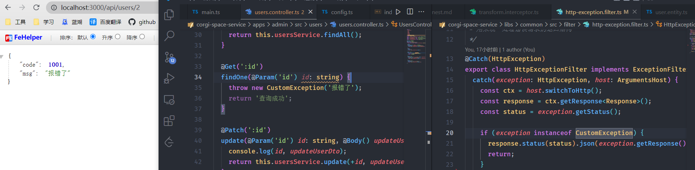

# 构建Nest项目

## 项目起步

首先对整体项目做一个预想，为了使客户端与管理端的代码相对独立，便于后续维护，需要将代码分为两个项目，但是这两个项目又会有一定程度上的耦合代码，为此采用`monorepo`模式。

`nest/cli`直接支持`monorepo`模式，所以项目初始则直接按照 [文档](https://docs.nestjs.cn/8/cli?id=%e5%b7%a5%e4%bd%9c%e7%a9%ba%e9%97%b4) 步骤即可，这里不再赘述。

为了方便管理共用代码，还需要建立`libs`放置在根目录，同样的 [文档](https://docs.nestjs.cn/8/cli?id=%e5%ba%93-1) 也对此方案有详细说明，这里我创建了名为 `common` 的公用包。

最终可以得到如下项目结构


之后就可以在业务中通过 `@app/common` 使用共用包中的代码。

## 统一返回格式

此时启动项目并访问接口，可以得到如下内容


但正常的项目中都有统一的返回格式，期望返回格式是这样的
```js
{
  data: any,
  code: 0,
  msg: 'success'
}
```

此时就需要引入 [拦截器](https://docs.nestjs.cn/8/interceptors)

由于两个项目都会需要此功能，所以作为公用插件需要写在 `libs` 中。

使用命令，自动创建一个拦截器模板
```
nest g in transform
```
作为公用包，选择放置在`common`中


写入需要的数据类型即可。

```ts
import {
  CallHandler,
  ExecutionContext,
  Injectable,
  NestInterceptor,
} from '@nestjs/common';
import { map, Observable } from 'rxjs';

@Injectable()
export class TransformInterceptor implements NestInterceptor {
  intercept(context: ExecutionContext, next: CallHandler): Observable<any> {
    return next.handle().pipe(
      map((data) => {
        return {
          data,
          code: 0,
          msg: 'success',
        };
      }),
    );
  }
}
```

记得先从 `index` 导入，就可以在项目中引用了

```ts
import { TransformInterceptor } from '@app/common';

async function bootstrap() {
  const app = await NestFactory.create(AppModule);
  /**
   * 添加全局前缀
   */
  app.setGlobalPrefix('api');

  app.useGlobalInterceptors(new TransformInterceptor());

  await app.listen(3000);
}
bootstrap();
```

## 异常过滤器

在对成功的请求做出格式调整后，还需要对异常做出调整，可以通过 [过滤器](https://docs.nestjs.cn/8/exceptionfilters) 实现

使用命令，自动创建一个过滤器模板，放置在`libs/common`中
```
nest g f transform httpException
```

写入代码
```ts
import {
  ArgumentsHost,
  Catch,
  ExceptionFilter,
  HttpException,
} from '@nestjs/common';
import { Response } from 'express';

/**
 * 用来统一处理错误请求的返回结构
 */
@Catch(HttpException)
export class HttpExceptionFilter implements ExceptionFilter {
  catch(exception: HttpException, host: ArgumentsHost) {
    const ctx = host.switchToHttp();
    const response = ctx.getResponse<Response>();
    const status = exception.getStatus();

    const message =
      exception.message ?? (status >= 500 ? 'Service Error' : 'Client Error');

    const errorResponse = {
      data: {},
      msg: message || '未知错误',
      code: status || -1,
    };

    response.status(status).json(errorResponse);
  }
}
```

这里规定了异常的返回格式，并判断了业务中发出的错误信息 `message`，之后在接口报错时就可以以正确的格式返回。


### 自定义异常

仅仅使用`Http`的异常信息还满足不了业务使用，所以需要封装业务本身的异常信息。

在`libs/common/src`内新建一个文件夹`exceptions`用来放置异常处理，新建文件`custom.business.ts`

```ts
import { HttpException, HttpStatus } from '@nestjs/common';
import { ERROR_CODE } from './error.codes';

export type TBusinessError = {
  code: ERROR_CODE;
  msg: string;
};

/**
 * 自定义异常 - 用于主动抛出
 */
export class CustomException extends HttpException {
  constructor(error: TBusinessError | string) {
    if (typeof error === 'string') {
      error = {
        code: ERROR_CODE.COMMON,
        msg: error,
      };
    }
    super(error, HttpStatus.OK);
  }
  static throwForbidden() {
    throw new CustomException({
      code: ERROR_CODE.ACCESS_FORBIDDEN,
      msg: '抱歉哦，您无此权限！',
    });
  }
}

```
`error.codes`用来定义异常`Code`
```ts
export enum ERROR_CODE {
  COMMON = 1001, // 公用错误
  ACCESS_FORBIDDEN = 1003, // 没有权限
}
```

此时还没结束，回到上文的异常过滤器中

```ts
// ...
import { CustomException, TBusinessError } from '..';

/**
 * 用来统一处理错误请求的返回结构
 */
@Catch(HttpException)
export class HttpExceptionFilter implements ExceptionFilter {
  catch(exception: HttpException, host: ArgumentsHost) {
    const ctx = host.switchToHttp();
    const response = ctx.getResponse<Response>();
    const status = exception.getStatus();

    /**
     * 判断异常是自定义的
     */
    if (exception instanceof CustomException) {
      response.status(status).json(exception.getResponse() as TBusinessError);
      return;
    }

    // ...
  }
}
```

这里对过滤的异常做出判断，由于自定义的异常在`Http`的层面是`HttpStatus.OK`成功的，所以此时的`status === 200`，并不符合我们的需求，所以要将拦截的内容`TBusinessError`直接返回。



## 连接数据库

本项目使用`TypeOrm` 搭配 `MySQL`， 关于数据库安装可以参考这里 

[MySQL 在 Windows 下安装教程、避坑指南](https://juejin.cn/post/6844904000152666126)

* 安装依赖
```
pnpm add @nestjs/typeorm typeorm mysql2 @nestjs/config
```

> 注意: 为了区分运行环境，还需要使用`@nestjs/config`做不同的配置

* 在根目录建立`.env.dev`和`.env.prod`, 写入需要用到的数据库配置
```
DB_HOST=localhost
DB_PORT=3306
DB_USERNAME=root
DB_PASSWORD=root
DB_DATABASE=corgi
DB_SYNCHRONIZE=true
```

* 修改`package.json`，在运行时标记环境
```js
    "start": "cross-env NODE_ENV=development nest start --watch",
    "start:prod": "cross-env NODE_ENV=production node dist/main",
```

* 写入`app.module`

```ts
import { Module } from '@nestjs/common';
import { ConfigService, ConfigModule } from '@nestjs/config';
import { TypeOrmModule } from '@nestjs/typeorm';
import { SnakeNamingStrategy } from 'typeorm-naming-strategies';
import { UsersModule } from './users/users.module';
import { SystemModule } from './system/system.module';

const isPord = process.env.NODE_ENV === 'production';
console.log('现在的环境是：', process.env.NODE_ENV);
@Module({
  imports: [
    ConfigModule.forRoot({
      envFilePath: isPord ? '.env.prod' : '.env.dev',
    }),
    TypeOrmModule.forRootAsync({
      imports: [ConfigModule],
      inject: [ConfigService],
      useFactory: async (configService: ConfigService) => ({
        type: 'mysql', // 数据库类型
        host: configService.get('DB_HOST'), // 主机，默认为localhost
        port: configService.get('DB_PORT'), // 端口号
        username: configService.get('DB_USERNAME'), // 用户名
        password: configService.get('DB_PASSWORD'), // 密码
        database: configService.get('DB_DATABASE'), //数据库名
        synchronize: configService.get('DB_SYNCHRONIZE'), //根据实体自动创建数据库表， 生产环境建议关闭
        autoLoadEntities: true, // 自动加载实体
        namingStrategy: new SnakeNamingStrategy(), // 将驼峰列名转为下划线
      }),
    }),

    UsersModule,
    SystemModule,
  ],
  controllers: [],
  providers: [],
})
export class AppModule {}

```
