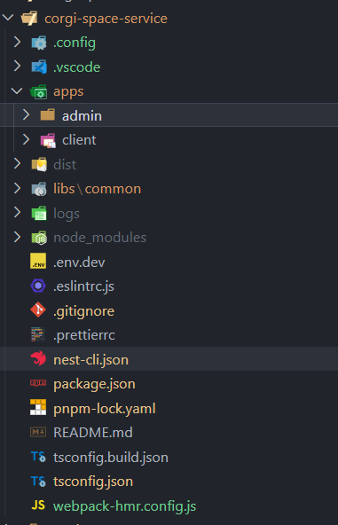
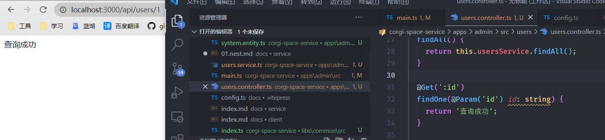
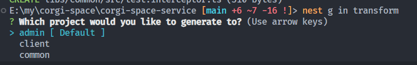
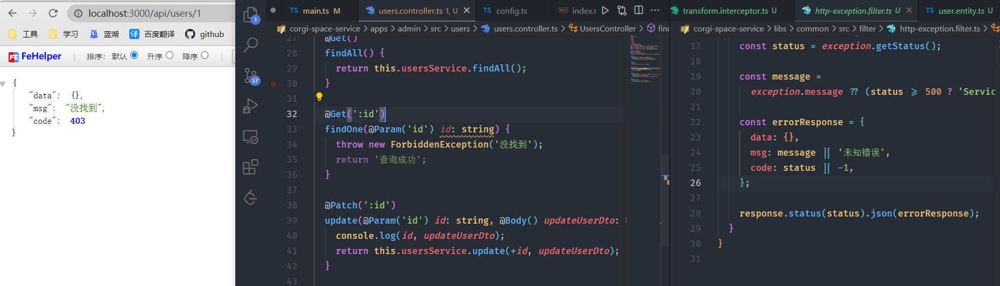

# 构建Nest项目

## 项目起步

首先对整体项目做一个预想，为了使客户端与管理端的代码相对独立，便于后续维护，需要将代码分为两个项目，但是这两个项目又会有一定程度上的耦合代码，为此采用`monorepo`模式。

`nest/cli`直接支持`monorepo`模式，所以项目初始则直接按照 [文档](https://docs.nestjs.cn/8/cli?id=%e5%b7%a5%e4%bd%9c%e7%a9%ba%e9%97%b4) 步骤即可，这里不再赘述。

为了方便管理共用代码，还需要建立`libs`放置在根目录，同样的 [文档](https://docs.nestjs.cn/8/cli?id=%e5%ba%93-1) 也对此方案有详细说明，这里我创建了名为 `common` 的公用包。

最终可以得到如下项目结构



之后就可以在业务中通过 `@app/common` 使用共用包中的代码。

## 统一返回格式

此时启动项目并访问接口，可以得到如下内容



但正常的项目中都有统一的返回格式，期望返回格式是这样的
```js
{
  data: any,
  code: 0,
  msg: 'success'
}
```

此时就需要引入 [拦截器](https://docs.nestjs.cn/8/interceptors)

由于两个项目都会需要此功能，所以作为公用插件需要写在 `libs` 中。

使用命令，自动创建一个拦截器模板
```
nest g in transform
```
作为公用包，选择放置在`common`中


写入需要的数据类型即可。

```ts
import {
  CallHandler,
  ExecutionContext,
  Injectable,
  NestInterceptor,
} from '@nestjs/common';
import { map, Observable } from 'rxjs';

@Injectable()
export class TransformInterceptor implements NestInterceptor {
  intercept(context: ExecutionContext, next: CallHandler): Observable<any> {
    return next.handle().pipe(
      map((data) => {
        return {
          data,
          code: 0,
          msg: 'success',
        };
      }),
    );
  }
}
```

记得先从 `index` 导入，就可以在项目中引用了

```ts
import { TransformInterceptor } from '@app/common';

async function bootstrap() {
  const app = await NestFactory.create(AppModule);
  /**
   * 添加全局前缀
   */
  app.setGlobalPrefix('api');

  app.useGlobalInterceptors(new TransformInterceptor());

  await app.listen(3000);
}
bootstrap();
```

## 异常过滤器

在对成功的请求做出格式调整后，还需要对异常做出调整，可以通过 [过滤器](https://docs.nestjs.cn/8/exceptionfilters) 实现

使用命令，自动创建一个过滤器模板，放置在`libs/common`中
```
nest g f transform httpException
```

写入代码
```ts
import {
  ArgumentsHost,
  Catch,
  ExceptionFilter,
  HttpException,
} from '@nestjs/common';
import { Response } from 'express';

/**
 * 用来统一处理错误请求的返回结构
 */
@Catch(HttpException)
export class HttpExceptionFilter implements ExceptionFilter {
  catch(exception: HttpException, host: ArgumentsHost) {
    const ctx = host.switchToHttp();
    const response = ctx.getResponse<Response>();
    const status = exception.getStatus();

    const message =
      exception.message ?? (status >= 500 ? 'Service Error' : 'Client Error');

    const errorResponse = {
      data: {},
      msg: message || '未知错误',
      code: status || -1,
    };

    response.status(status).json(errorResponse);
  }
}
```

这里规定了异常的返回格式，并判断了业务中发出的错误信息 `message`，之后在接口报错时就可以以正确的格式返回。




